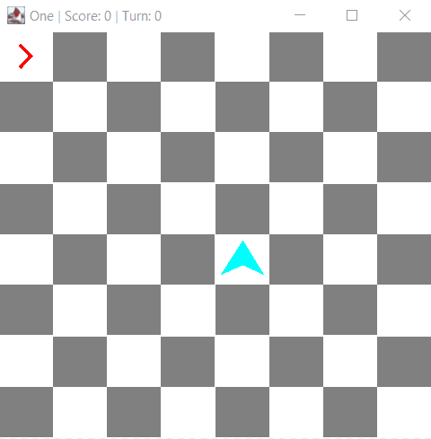

# one

This was a little game I made during breaks during my freshman year of high school. I have since revisited it, updating with new skills and better tools.

----

## Gameplay

Defeat an endless horde of enemies in this simple turn-based game.

Each turn, you move then your enemies move. Moving onto or attacking an enemy kills it-- but be careful, if an enemy moves onto you, it's game over!

| Controls: |        |
| --------- | ------ |
| `WASD`    | Move to a neighboring tile, defeating any enemy in it. |
| `IJKL`    | Attack a neighboring tile without moving. |
| `Q`       | Pass your turn, allowing enemies to fall into your carefully planned traps! |

Each defeated enemy grants ten points; note that this still applies when multiple enemies are in the same tile.

*Recording has been accelerated for display purposes.*

----

## Original Version

This is the version I made as a highschool freshman-- I credit this game with being the start of my building real standalone hobby software projects other than Minecraft plugins/mods and a number of half-finished or demo projects.

[**View code here**](https://github.com/2kai2kai2/one/tree/47da10623d1e926d05eca522970b7d975aa36a50)
Originally, this project was purely in the terminal and had an ascii art interface.